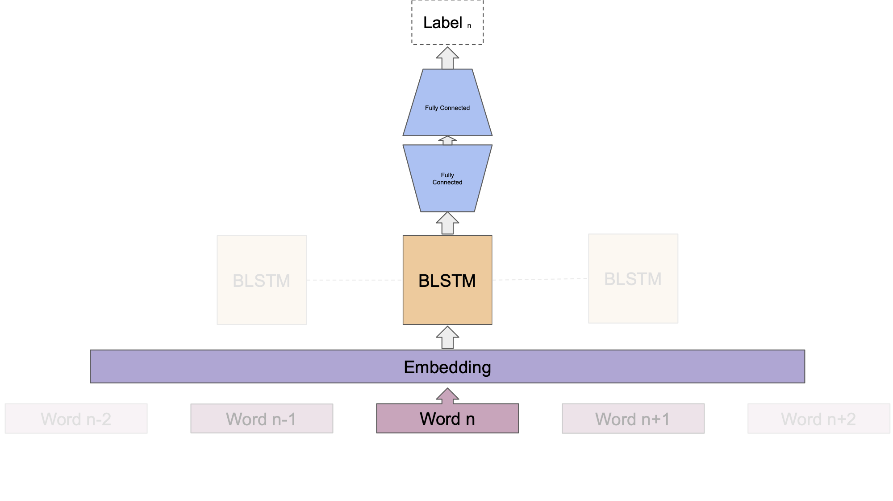
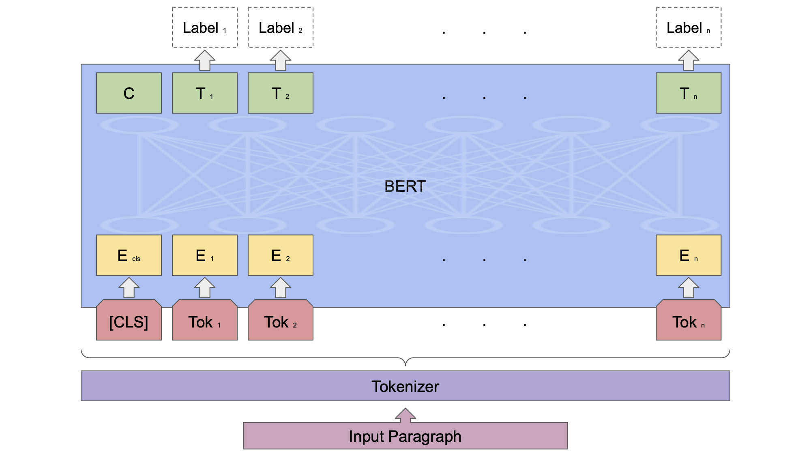
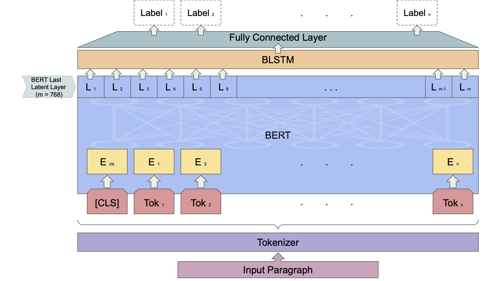
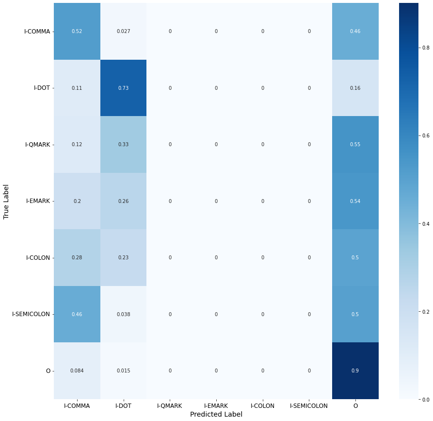
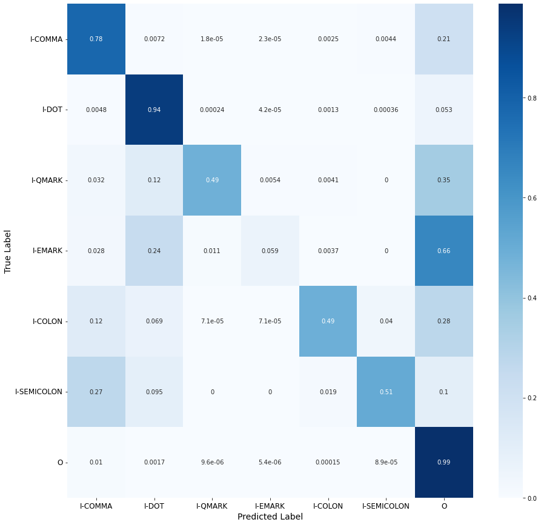
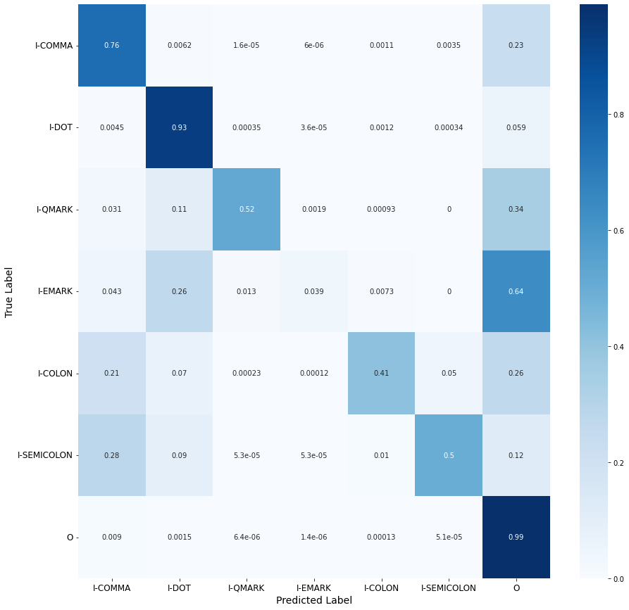

# Punctuation Prediction Using NER Models
This is the course project for Data Mining EECS6412 at York University. For the full report, please read [this file](./Data_Mining_Report.pdf).

# Dataset
We have used Wikipedia dataset [Wikitext103V1](https://blog.salesforceairesearch.com/the-wikitext-long-term-dependency-language-modeling-dataset/).

# Models
In this project we have implemented 3 different models for the punctuation prediction task.

1. BLSTM: 

2. BERT:

3. BLSTM on BERT: 

# Results
1. BLSTM: 

2. BERT:

3. BLSTM on BERT: 

